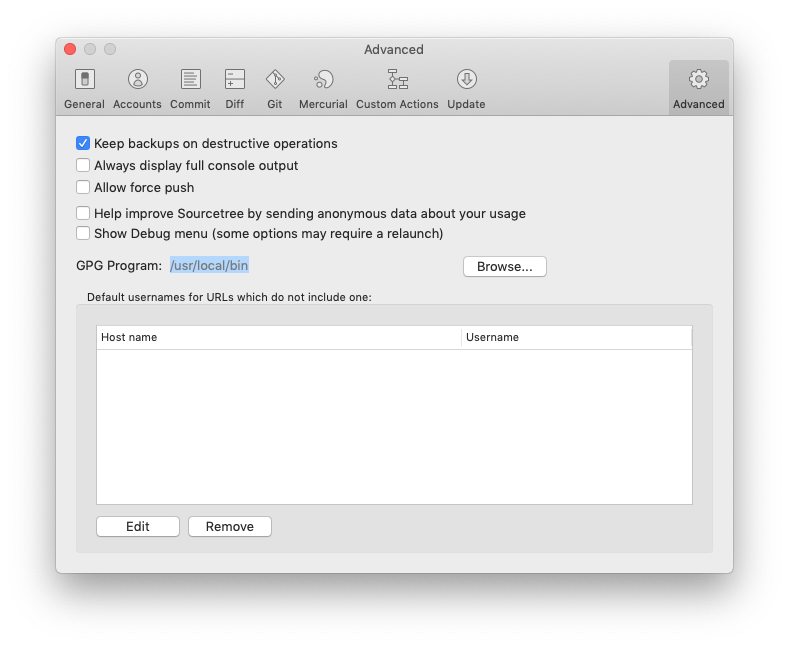

# 🖥🏗 MacOS setup
Scripts for setting up a brand new MacOS, and getting it ready to work in no time

## Installation
1. Download this repo: `$ git clone git@github.com:vol24pl/MacOS-setup.git`
2. Add permissions to execute the script: `$ chmod +x ./macbook-initial-setup.sh`
3. Edit this script to your own liking: `$ nano ./macbook-initial-setup.sh` 
4. Run the script: `$ ./macbook-initial-setup.sh`

If something goes wrong look for tips in `other/setup-hotfixes.sh`
## Additional (optional) steps after the install

- [ ] Edit template in `other/ssh-config.txt` and copy it to `~/.ssh/config`
- [ ] Add [GoldenChaos-BTT](https://community.folivora.ai/t/goldenchaos-btt-a-complete-touch-bar-ui-replacement-preset/1281)
- [ ] Install [Additional Tools for Xcode](https://developer.apple.com/download/more/) and enable AAC (max bitrate)
- [ ] Setup UEFI firmware password and set booting to the strickest setting (only Apple-Signed code)
- [ ] Change monotype font everywhere to: `SF Mono 12`
- [ ] Fix SourceTree to work with GPG keys, by setting GPG program to `/usr/local/bin`

